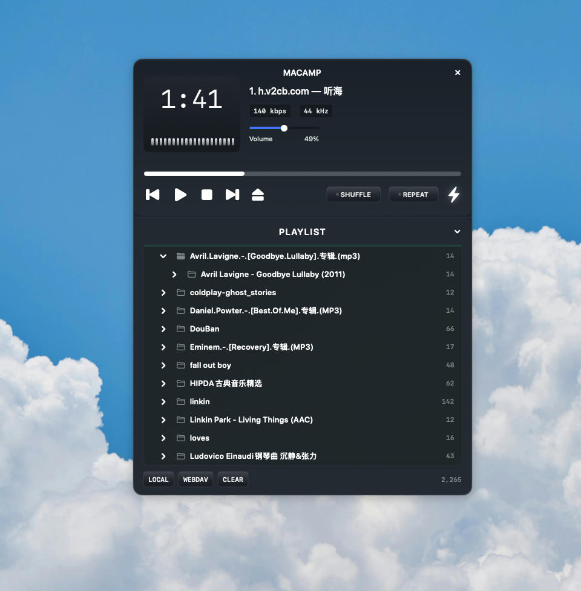

<p align="center">
  
</p>

# MACAMP

A Winamp-inspired music player for macOS, built with SwiftUI. Supports local folders and WebDAV remote sources — play your MP3, FLAC, AAC, OGG, WAV, and more.

## Features

- **Winamp-style skin** — dark skeuomorphic UI with spectrum visualizer, scrolling title, and classic transport controls
- **Local folder playback** — open any folder, recursively scans for supported audio files
- **WebDAV support** — stream music directly from your WebDAV server (with Basic Auth)
- **9 audio formats** — MP3, FLAC, AAC, ALAC, AIFF, OGG, WAV, CAF, M4A
- **Playlist browser** — folder tree with expand/collapse, double-click to play
- **Shuffle & Repeat** — toggle modes with visual indicator lamps
- **Real-time spectrum** — 24-bar amplitude-based visualizer when playing local files
- **Volume control** — ties into macOS system volume
- **Persistent library** — sources and bookmarks survive app restarts via UserDefaults
- **Zero dependencies** — pure Swift, Apple frameworks only

## Requirements

- macOS 14 (Sonoma) or later
- Xcode 15+ (Swift 5.10)

## Build & Run

### Debug (ARM64)

```bash
swift build -c debug --arch arm64
swift run -c debug --arch arm64
```

### Release (ARM64 + x86_64 Universal app bundle)

```bash
./build-app.sh
open .build/app/MusicPlayer.app
```

### Manual Release Build

```bash
swift build -c release --arch arm64
swift build -c release --arch x86_64
```

## Usage

| Action | How |
|---|---|
| Add local folder | Click **LOCAL** in playlist footer or press `Cmd+O` |
| Add WebDAV server | Click **WEBDAV**, enter URL and credentials |
| Play a track | Double-click in playlist |
| Play entire folder | Click the folder name |
| Collapse/expand playlist | Click the toggle button above the playlist |
| Seek | Drag the progress strip |
| Volume | Drag the volume slider |
| Remove source | Right-click a source in the tree → Remove |

## Architecture

```
Sources/MusicPlayer/
├── MusicPlayerApp.swift     # App entry point
├── ContentView.swift         # Winamp-style UI (top deck + playlist)
├── PlayerEngine.swift        # AVPlayer playback, queue, spectrum, volume
├── LibraryStore.swift        # Music library, file scanning, persistence
├── WebDAVClient.swift        # WebDAV PROPFIND client
├── Models.swift              # Data models & supported formats
└── Theme.swift               # Color palette & UI constants
```

- **UI**: SwiftUI with AppKit bridging for borderless window
- **Playback**: AVPlayer + AVAssetReader (spectrum analysis)
- **Volume**: CoreAudio system volume
- **WebDAV**: URLSession + XMLParser for PROPFIND
- **Persistence**: UserDefaults (JSON + security-scoped bookmarks)

## License

MIT
